### Saket Shirsath, Parth Thakkar, Ben Wolfson
 
[Project Proposal](proposal.md)

# Midterm Update 1

## Abstract:

Weightlifters, both old and new injure, themselves while performing popular exercises like bench press, squats, and deadlifts. We aim to create a program that will identify which exercise is being performed and what corrections need to be made to have ideal form. Our main objective for this update is to identify which exercise is being performed. We took two approaches to identify exercises: a convolutional neural network pre-trained with the MPII Human Pose Dataset and a convolutional neural network built with Keras and trained with images scraped from the internet. Both provided very promising initial results.

## Teaser Figure:

## Pose Identification using a Convolutional Neural Network: 

One of our milestones for this iteration of our project was the successful pose detection of the exercises we are working with. This entails finding the wire figures of a person’s body when performing a particular exercise. The approach we take with this requires us to train a neural network with the MPII Human Pose Dataset. The first stage of the process is to create a set of 2D confidence maps of body part locations such as the elbow, knee, wrist, etc. Once that is done, the confidence maps are run through an algorithm to produce the 2D joint locations for the person in the image. 

| Squat | Bench | Deadlift |
| ----- | ----- | -------- |
||||

## Results for HPE

Our goal while using this approach was to develop a library of poses for each of these exercises so that when we pass in an input image into our program, we can compare the pose for that to our library using an image comparison algorithm such as shortest squared distance or structural similarity measure. We quickly realized that while this approach was not very consistent. There were often similarities in pose position when it came to exercises like the squat and the deadlift, and we were not getting accurate results. It seemed that the position of the barbell with respect to the body in the image was a bigger factor in exercise classification than we originally thought.

Nevertheless, the results of the human pose estimation were very promising. We speculate that the actual positions of the joints could definitely be taken into account to give form recommendations to the user if we would classify the exercise being performed correctly. As a result, we needed to find a more accurate way to detect our exercises.

## Image Classification with Categorical Convolutional Neural Network

To solve our issue with accurate exercise classification, we experimented with a brute-force categorical convolutional neural network built with Keras. Using the Bing Web Search API, we scraped 250 images for each of the chosen exercises: barbell bench press, barbell back squat, and barbell deadlift. Then, we manually filtered through those to throw away faulty representations and fix formatting issues. For our final dataset, we were left with 155 bench press images, 196 squat images, and 198 deadlift images. For model validation, we randomly allocated 20% of our dataset. The associated image collections are shown in the Appendix.

## Results

We started with a single-layer CNN, altering input normalization resolution to see how it affected training and validation accuracy and loss. These preliminary results indicate decent validation accuracy (~70%) for 25x25 and 50x50 normalizations. The 100x100 and 150x150 normalizations are significantly more accurate at around 80%. These graphs indicate that our model is overfitting our training dataset, as is evident by the nearly 100% training accuracy. This is to be expected due to our extremely small dataset.
| asdf |
| ----- | ------------------------------------------------------ | ------------------------------------------------------- |
| 25x25 | 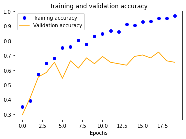 | 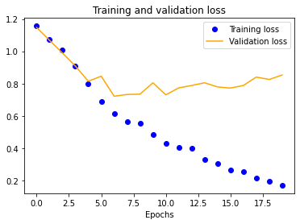 |
| 50x50 | 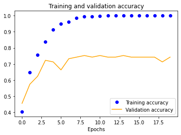 | 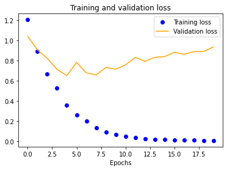 |
| 100x100 | 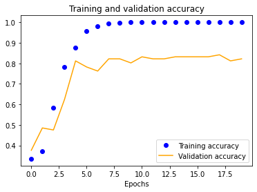 | 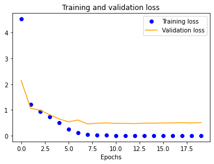 |
| 150x150 | 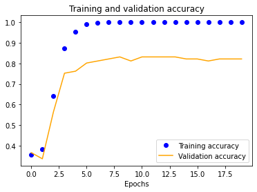 | 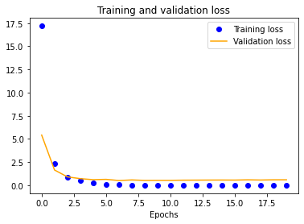 |

The results for the three-layer CNN are worse than the single-layer design. Typically, more layers result in higher validation accuracy, but our dataset is so small and our model is so overfitted that we get the opposite effect, resulting in significantly less validation accuracy across the board.

| asdf |
| ----- | ------------------------------------------------------ | ------------------------------------------------------- |
| 25x25 |  |  |
| 50x50 |  | 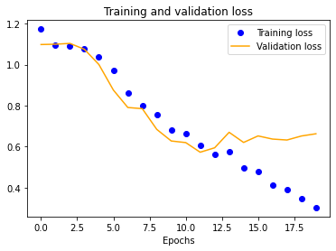 |
| 100x100 | 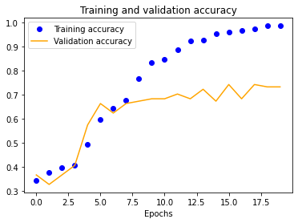 |  |
| 150x150 | 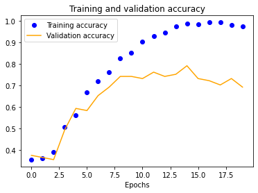 | 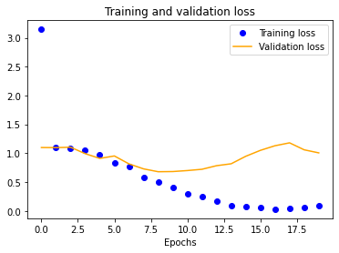 |

We also see a similar trend with our four-layer implementation.

| asdf |
| ----- | ------------------------------------------------------ | ------------------------------------------------------- |
| 25x25 | 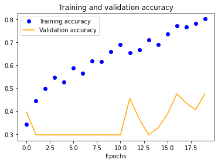 | 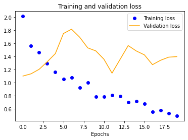 |
| 50x50 | 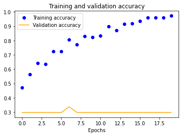 | 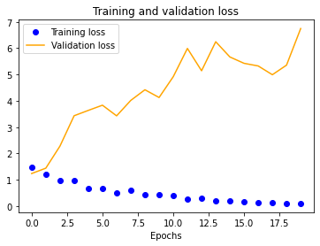 |
| 100x100 | 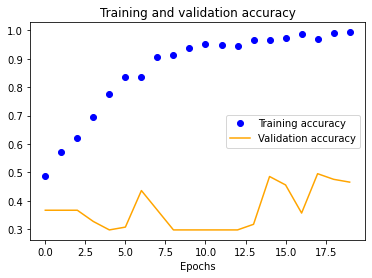 | 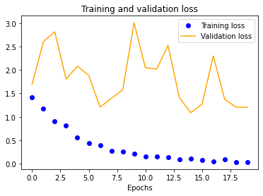 |
| 150x150 | 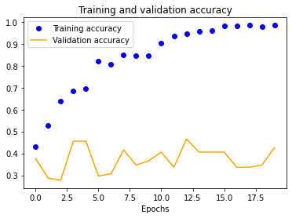 | 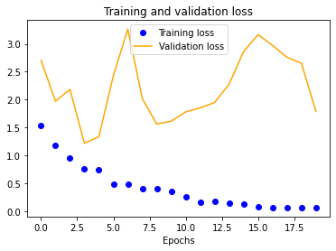 |

Next Steps
Our current dataset is severely limiting the performance of our CNN. There are two ways to expand it: (1) data augmentation and (2) just collecting more images. We will experiment with both of these for the final implementation to get our validation accuracy closer to 100%. It may be possible to improve accuracy by running our dataset images with their associated HPE outputs.

Once we fix these points, the multi-layer designs should drastically outperform their single-layer counterpart. In fact, it might even be possible to reduce our normalized image sizes to improve training speeds. As shown earlier, a 50x50 image may be sufficient, as is evident by its close to 100% training accuracy.

Now that we are able to successfully classify our exercise image inputs as the correct exercise, we can move forward with our original goal of outputting recommendations to users regarding their form. One approach we can take is using the output of our human pose estimation CNN to measure the location of certain joints compared to others. For example, in a squat, if the elbows are parallel to the wrist, that is an indication of bad form, and we should be able to detect that.

Another approach is to expand on the CNN we used to classify exercises. We can potentially use it to classify both the exercise and any indications of bad form at the same time. The only potential issue with this is that we will have to generate an even larger dataset of images than before to accommodate exercises of good form and bad form.

## Appendix

### Squat HPE

 

### Bench HPE

### Deadlift HPE

