### Saket Shirsath, Parth Thakkar, Ben Wolfson
 
[Project Proposal](proposal.md) | [Project Update 1](midterm_update.md)

# Final Report

## Teaser Figure:

## Abstract:

Lifting weights is an essential component to any good exercise regime. However, it can also be dangerous if performed incorrectly. We present a solution that can detect and make suggestions to improve a user’s form in the three main compound movements—barbell bench press, squat, and deadlift. After identifying the exercise being performed through a convolutional neural net (CNN), we then extrapolated the positions of our user’s joints using a pre-trained human pose CNN. We then compare the localities of these joints in relation to each other to determine whether there is anomalous deviation. Finally, after analyzing the data returned by both CNNs, we output feedback to the user with information regarding how to improve their form. After experimenting with different training datasets, our final model has relatively accurate classification (~80%), but the lack of robust open source weightlifting datasets is extremely limiting. In addition, whilst the use of human pose estimation to evaluate the positions of joints is extremely promising for form detection, there is definitely calibration to be done to make the system camera-angle invariant.

## Introduction:

Most weightlifting injuries occur as a result of using incorrect form while performing individual exercises. The most popular of these among strength enthusiasts are the barbell bench press, squat, and deadlift—known as the “big three”. It just so happens that these exercises in particular are some of the easiest to perform improperly, and as a result, can be quite dangerous. Our goal with this project is to build a solution that can help users fix their own form and learn to perform these lifts correctly.

Incorrect form has become an increasingly problematic issue in the wake of COVID. Gyms are hotspots for viral transmission, and many beginners are electing to start their fitness journeys at home. However, without feedback from a personal trainer and minimal prior experience, it can be quite a difficult task to learn how to lift weights properly. Many commercial solutions exist on the market for interactive at-home exercise, such as Peloton ($2000), Tonal ($3000), and MIRROR ($1500). However, none offer real-time feedback, except for MIRROR—which charges an additional $40 per session with a live trainer. Further, none of these are tailored specifically for addressing free weights.

The proliferation of machine learning research in the past decade has also trickled into exercise science. A number of researchers have attempted to build models to address the problems associated with exercise classification and form detection. One example is GymCam: a tool for detecting, recognizing, and tracking simultaneous exercises in unconstrained scenes. Khurana et al. used an approach that they call “frequency-based feature matching” which uses human pose estimation to track joint movements, surveying for periodic movements and identifying individual exercises based on joint trajectory and frequency sampling within those localities. Another is Pose Trainer: a tool for correcting exercise posture with pose estimation, evaluating form based on angles and distances between joints, using thresholding to determine improper movement patterns.

While Pose Trainer’s function is remarkably similar to what we are trying to accomplish, it focuses on minor bodily tendencies for more niche exercises like the bicep curl and the shoulder shrug. These are known as isolation exercises, and unlike compound movements (such as the big three), only involve a single joint. The risk of injury performing these isolation movements is quite small. Focusing on isolation exercises allows Pose Trainer to focus on the movement of a single joint, making angle and position analysis a relatively straightforward task.

Our approach is more holistic. Instead of focusing on one or two specific joints, we attempt to evaluate the position of multiple joints in relation to each other to provide feedback based on the type of exercise the user is performing. We use our Human Pose Estimation model to track these joints, and find relations between them based on known tendencies of bad form. If certain joints are positioned in the wrong angle or are the wrong distance away from each other, the chances of long-term injury can be quite severe.  By identifying these high-level form breakdowns that beginner lifters often neglect, we can mitigate potential future injuries.

## Approach

### Part 1: Image Classification 

The first part of our solution is to classify images. Initially, we wanted to develop a library of human poses corresponding to each exercise, so that when we pass in an input image, we could find its closest match using an image comparison algorithm such as shortest squared distance or structural similarity measure between joints. The preliminary testing indicated that this approach was extremely inconsistent, despite obvious positional similarities across the same exercise. This inconsistency was most likely due to camera angle variance. Additionally, it seemed that the position of the barbell with respect to the body in the image was a bigger factor to classification than we originally thought. For example, in the bench press, users hold their arms out fully extended, just like in the deadlift, which can create some confusion when trying to cross correlate between joints across different exercises.

As a result of these shortcomings, we decided to pivot to a brute-force categorical convolutional neural net (CNN), which we built using TensorFlow and Keras with the following architecture:

Using the Bing Web Search API, we scraped 250 images for each of the chosen exercises: barbell bench press, barbell back squat, and barbell deadlift. Then, we manually filtered through those to throw away faulty representations and fix formatting issues. Based on the accuracy of this model (~80%), we decided to move forward with using a CNN for our classification needs.

Based on the limited size of this initial dataset, we wanted to improve accuracy by gathering more images. However, none are readily available on the internet, and scraping search engines results in increasingly lower quality images the more you collect. So, we started making our own, capturing over 1000 images for each of our three exercises, using four different subjects of different races to hopefully alleviate any potential biasing. This significant increase in our image count was very taxing on our machines’ computational capabilities. Finally, we decided to see what training our model on a dataset of pure HPE output would yield.

### Part 2: Human Pose Estimation

*Obtained from LearnOpenCV*

Human pose estimation (HPE) is an extremely relevant resource for form analysis, since it allows us to extract important keypoint information from a user, e.g. major body parts (arms, legs, spine, etc.) and joints (shoulders, ankles, knees, etc.).

Although there exist a few notable approaches to HPE, we will use the deep neural net method outlined by Cao et al. in Realtime Multi-Person 2D Pose Estimation using Part Affinity Fields at Carnegie Mellon’s Perceptual Computing Lab. Cao et al. recommend two widely regarded keypoint models: MPII and Coco. We used MPII since it does a better job of segmenting the torso and spine, which proved useful in our analysis.

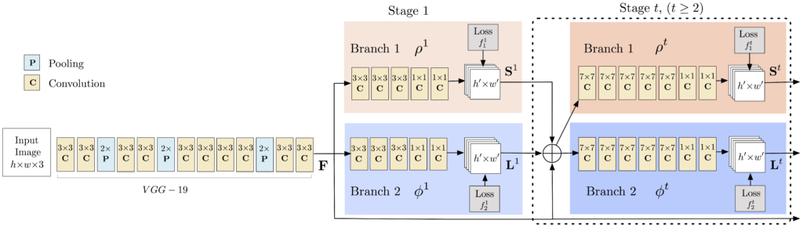

*Acquired from LearnOpenCV*

Above is the architecture for the Human Pose Estimation model. Using this model, we are able to pass in an image and receive a layout of at most 15 major points on the body as they are displayed in the image. The points are returned if they are detected above a certain thresholded confidence level. 

Our main approach for this part was concerned more with what type of images we were to pass into the model rather than building the model itself. The model itself was developed mainly for images with standing bodies at a frontal angle. As mentioned earlier, the exercises we want to provide as inputs to this model have the body bending or lying. This means that there are certain optimal angles that we must obtain for our input images for **Part 3: Form Feedback** in order to get optimal feedback for our images. In addition, if certain exercises or angles were not generating a proper Human Pose Estimation, we wanted to figure out what body points were being excluded and how we could work around them.

### Part 3: Form Feedback

At this stage, we are prepared to treat **Part 1: Image Classification** and **Part 2: Human Pose Estimation** as black boxes. Now that we have classified the exercise and have valid human pose data for the image, it is time to analyze the position of these points in relation to each other to determine feedback to give to the user. To give a better example of what we mean by the body points in relation to each other: consider the following image with its body points laid on top of the image.

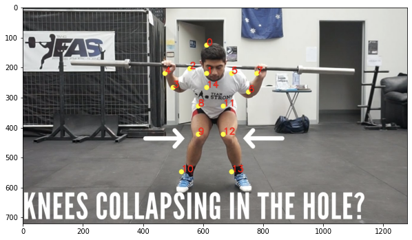

If you look at this image, you can see that the man’s knees are collapsing inwards as he squats. This issue can lead to snapped tendons or even knee replacements. However, it is relatively easy to detect if you consider the distance between the knees versus the distance between the ankles. The former is significantly smaller than the latter which allows us to provide feedback to the user. We take a similar approach for common issues known with the Big 3 exercises in order to find issues with a user’s input.

This approach works significantly better than just a blind comparison between 2 images using an image differentiating formula such as sum of squared distance or even using a neural net classification system. Because we are able to identify the exact points in the image to look at, we can much more easily identify what issues may be taking place. The blind comparison approach or the neural net approach look at the image more holistically, and it is possible for it to miss things especially when there are multiple issues in the image.

## Experiments and Results

### Part 1: Image Classification

Using our initial dataset, we trained a single-layer CNN in Keras, altering image input normalization resolution to see how it affected training and validation accuracy and loss. These preliminary results indicated decent validation accuracy (~70%) for 25x25 and 50x50 normalizations. The 100x100 and 150x150 normalizations are significantly more accurate at around 80%. These graphs indicate that our model is overfitting our training dataset, as is evident by the nearly 100% training accuracy. This is to be expected due to our extremely small dataset.

| 25x25 | 50x50 | 100x100 | 150x150 |
| ----- | ----- | ------- | ------- |
| 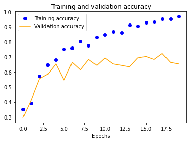 | 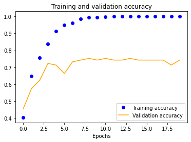 | 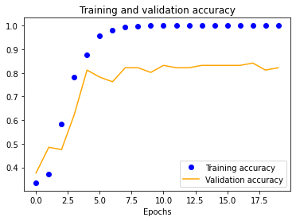 | 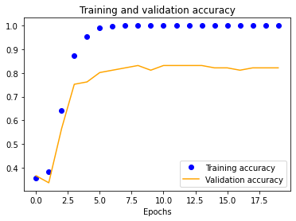 |
| 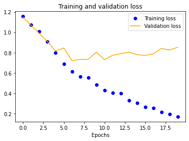 |  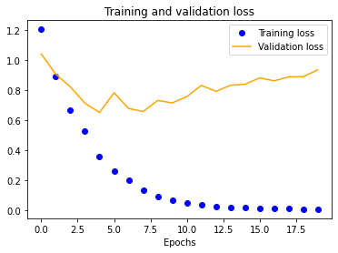 | 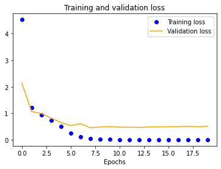 | 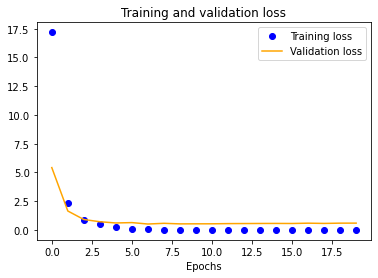 |

The results for the three-layer CNN are worse than the single-layer design. Typically, more layers result in higher validation accuracy, but our dataset is so small and our model is so overfitted that we get the opposite effect, resulting in significantly less validation accuracy across the board.

| 25x25 | 50x50 | 100x100 | 150x150 |
| ----- | ----- | ------- | ------- |
| 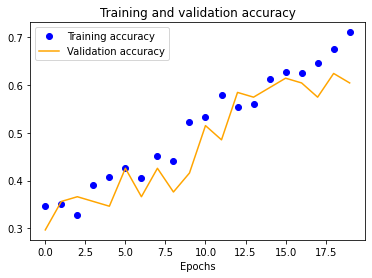 | 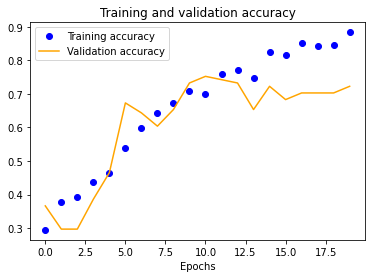 |  | 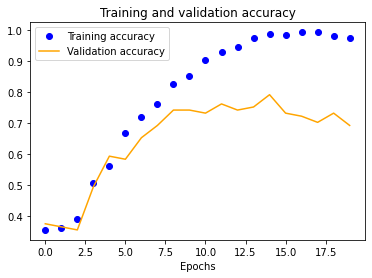 |
| 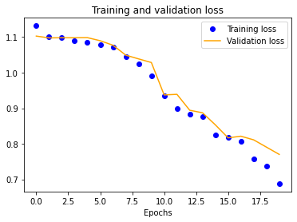 |  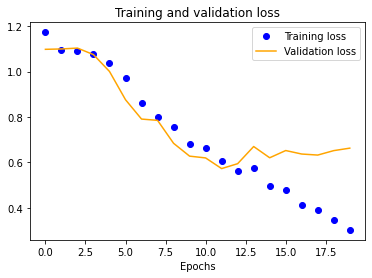 | 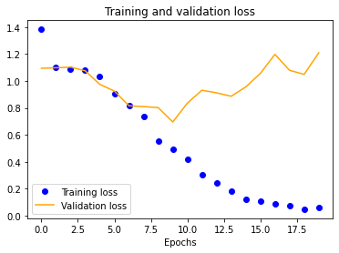 | 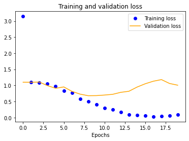 |

We also see a similar trend with our four-layer implementation.

| 25x25 | 50x50 | 100x100 | 150x150 |
| ----- | ----- | ------- | ------- |
| 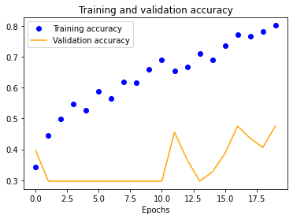 | 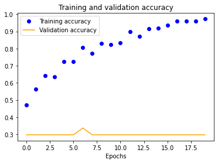 |  |  |
| 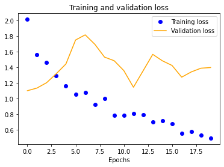 |  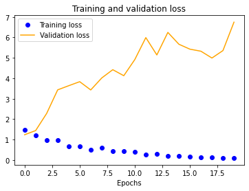 | 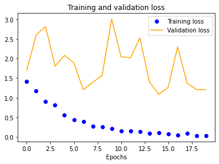 |  |

Using our expanded dataset, we performed similar testing to determine baseline accuracy at 100x100 normalization. It is important to note that this is the only experiment we ran due to the significant amount of computational resources needed to do so. Unfortunately, this model had worse transferable accuracy (~70%) than our initial, most likely due to the mostly consistent background (we photographed in only one gym) which our CNN likely incorporated into its evaluation heuristic.

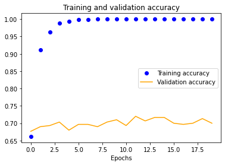
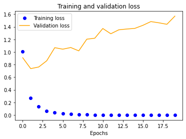

Finally, we decided to see what training our model on a dataset of pure HPE output with 100x100 normalization would yield to gauge whether it would be better to use going forward. Unfortunately, it was significantly worse at around 62% verification accuracy.

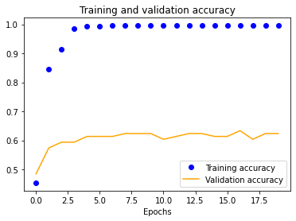
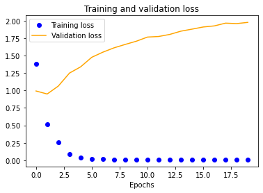

### Part 2: Human Pose Estimation

We pass in several images of each exercise type to our Human Pose Estimation model to detect which exercises along with what camera angle work best with the evaluation. This is essential for our **Part 3: Form Feedback** so that we can indicate to a user what the best way for them to position themselves performing the exercise so they can receive feedback.

The MPII Human Pose Dataset evaluates 15 points on the human body based on a thresholded confidence level to tell us whether the body point was successfully detected. For us to give the best feedback to the user, we evaluate how many body points are successfully detected for each of the 3 exercises from different angles so that we can use similar images in **Part 3: Form Feedback**. The graphs below display the number of human points detected for several exercises for each exercise type.

#### Bench Press HPE:

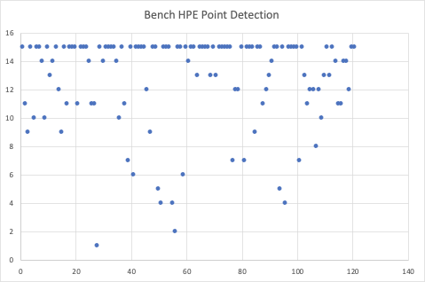

We passed in 121 images of the bench press being performed into the HPE model. Compared to the squat and the deadlift, you can see that the overall point detection for the bench press is significantly poorer judging on the number of images that resulted in less than 15 points detected. We suspect this is due to the fact that the HPE model was mainly trained on standing bodies. In a bench press, a person is lying down, thus making it difficult for exact points to be detected.

#### Squat HPE:

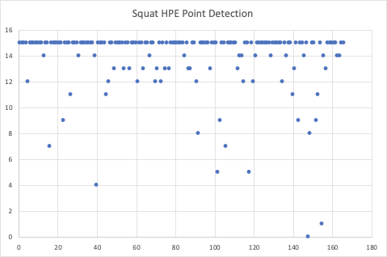

We passed in 166 images of the squat being performed into the HPE model. As you can see, the overall point detection for a squat usually results in 15 points detected. There are a few outlier points where the number is significantly lower than 15. These images are usually those with a significant amount of background equipment, or the image is not very clear.

#### Deadlift HPE:

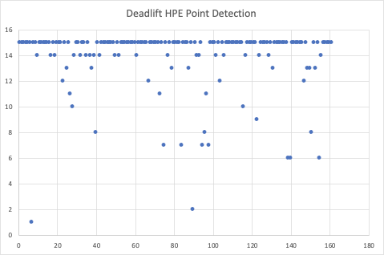

We passed in 161 images of the squat being performed into the HPE model. As you can see, the overall point detection for a squat usually results in 15 points detected. There are a few outlier points where the number is significantly lower than 15. Similarly to the squat, these images are usually those with a significant amount of background equipment, or the image is not very clear. In addition, there are cases where a side angle view of a person doesn’t result in proper point detection.

### Part 3: Form Feedback

We focus on 2-3 issues for each of the “Big 3” exercises. We began looking through images for relative distances between joints that would signify that one of these issues has been detected. Once we had done that, we took the algorithm we had created to test on images of the exercises.
For each of these issues, we select 3 images that demonstrate a person performing the exercise with the particular issue. We test to make sure that in these 3 images the issue is detected, and we also test in 3 control images where there is no issue that no issue is detected.

Squat Form Feedback:

| Issue | Good Form Images Where Issue was Detected (out of 3) | Bad Form Images Where Issue was Detected (out of 3) |
| ----- | ---------------------------------------------------- | --------------------------------------------------- |
| Caved in knees | 1 | 3 |
| Knees ahead of body | 2 | 3 |
| Neck and back curving | 0 | 2 |

Deadlift Form Feedback:

| Issue | Good Form Images Where Issue was Detected (out of 3) | Bad Form Images Where Issue was Detected (out of 3) |
| ----- | ---------------------------------------------------- | --------------------------------------------------- |
| Flared elbows | 1 | 2 |
| Curved back | 0 | 2 |

Bench Form Feedback:

| Issue | Good Form Images Where Issue was Detected (out of 3) | Bad Form Images Where Issue was Detected (out of 3) |
| ----- | ---------------------------------------------------- | --------------------------------------------------- |
| Feet not on ground | 0 | 3 |
| Excessive arch | 0 | 1 |
| Arms not in line with chest | 0 | 2 |

As you can see from the results, for most issues, we were able to detect an instance of bad form and successfully report it. While performing the experiment, the most common pitfall we ran into was that of the “curved back”. This is an issue with all 3 of the exercises, but it seemed that the HPE estimation model had trouble detecting the head and the chest when the back was curved to the degree it was in some of the bad form examples. 

## Qualitative Results

### Part 1: Image Classification
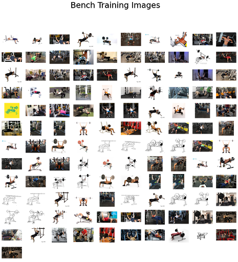
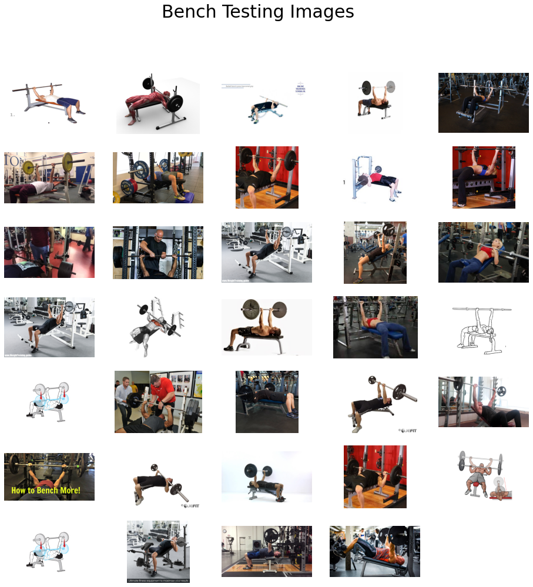

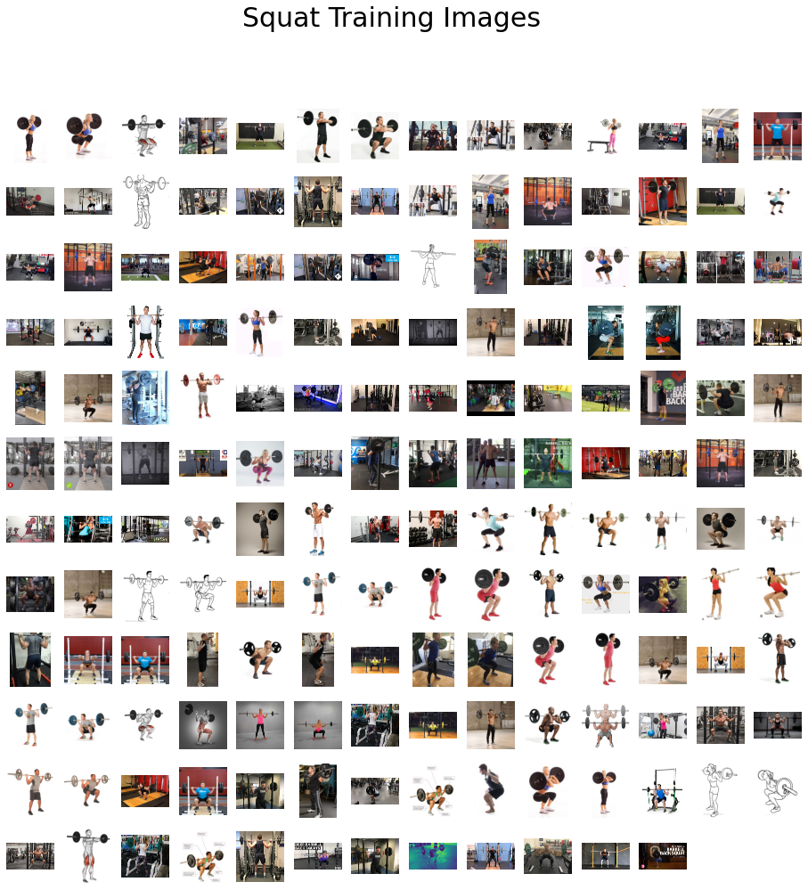
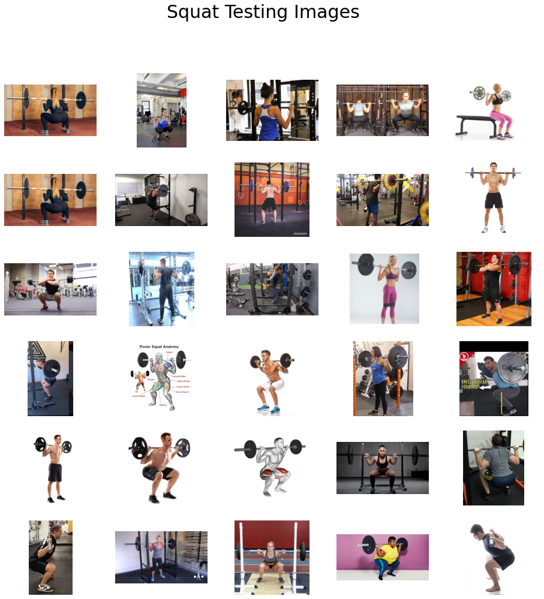

[LINK to expanded dataset (too large to be embedded or visualized)](https://www.dropbox.com/sh/7kgq12xv5evkoz0/AAB6EKO-6uU_nEeShxbkOluBa?dl=0)

### Part 2: Human Pose Estimation

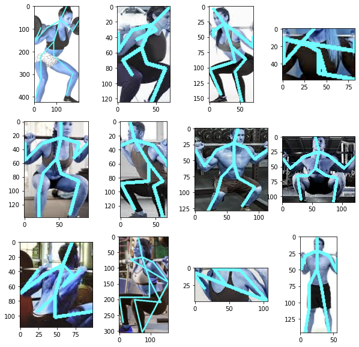
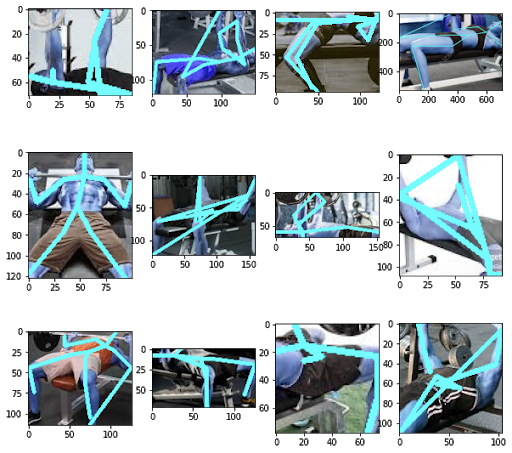
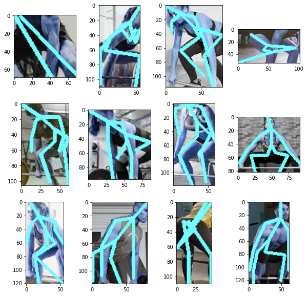

### Part 3: Form Feedback

Squat Form Feedback:

| Image | Feedback | 
| ----- | -------- |
|  | Your knees are too caved in. Use a lighter weight. Your shoulders are uneven. Stretch them out before lifting and consider lowering the weight. |
| 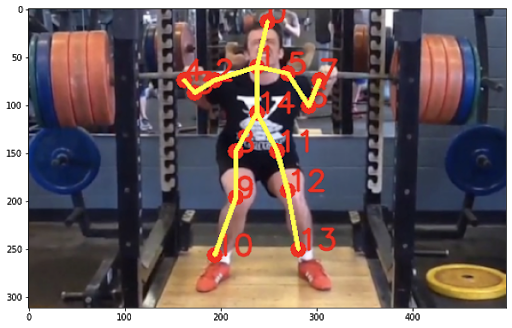 | Your knees are too caved in. Use a lighter weight. |
| 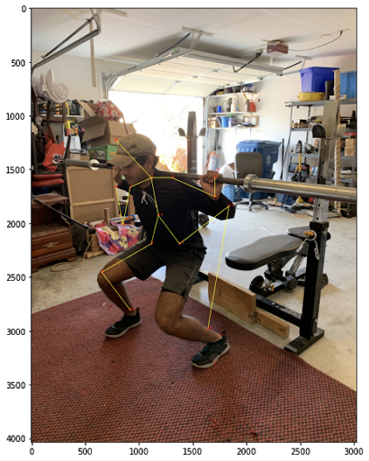 | Your knees are too far out in front of you. Squat with your butt, not your knees! |
| 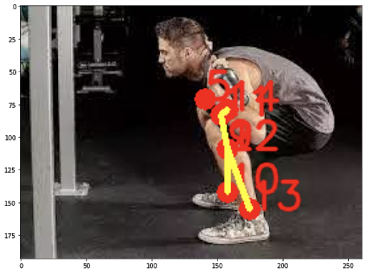 | Your knees are too caved in. Use a lighter weight. Your shoulders are uneven. Stretch them out before lifting and consider lowering the weight. DANGER! Your neck and back are curved in a way that will cause you grave injury. Please lower the weight, keep your neck and back straight, and try again! |
| 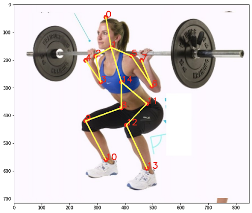 | *Failure Case - nothing is wrong with this form* Your knees are too far out in front of you. Squat with your butt, not your knees! |

Deadlift Form Feedback:

| Image | Feedback | 
| ----- | -------- |
| 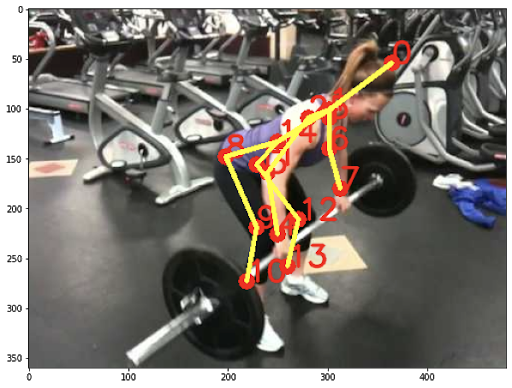 | Your elbows are flaring out. Keep your arms in line with your shoulders. |
| 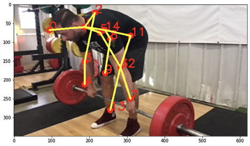 | DANGER! Your neck and back are curved in a way that will cause you grave injury. Please lower the weight, keep your neck and back straight, and try again! |
| 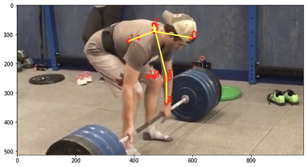 | DANGER! Your neck and back are curved in a way that will cause you grave injury. Please lower the weight, keep your neck and back straight, and try again! |
| 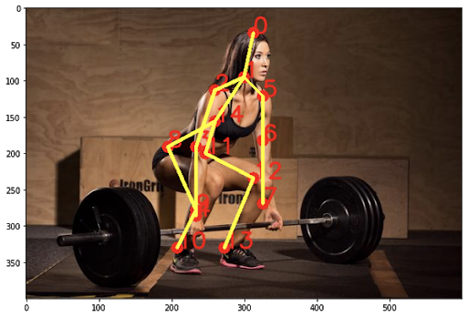 | All good! Keep at it! |

Bench Press Form Feedback:

| Image | Feedback | 
| ----- | -------- |
| 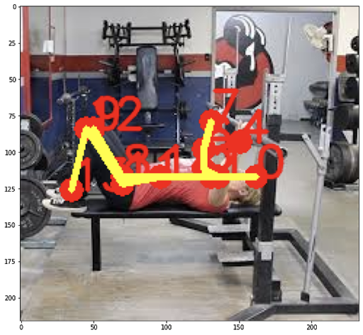 | Keep your feet planted on the ground! It will help increase your power. |
| 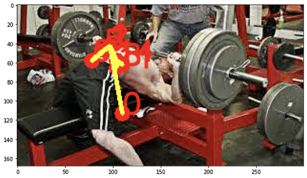 | Your arch is a bit excessive. Keep your butt on the bench. |
| 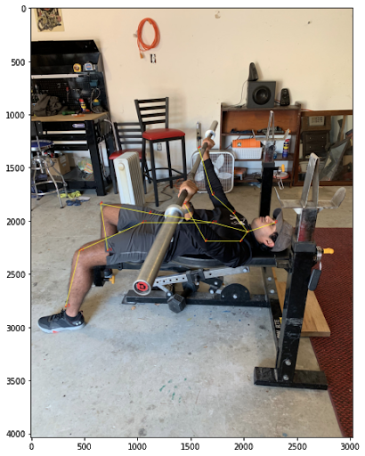 | Your arms are way too out in front of you. Keep them in line with your chest. |
| 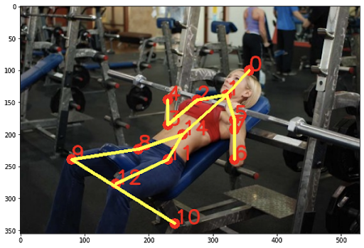 | All good! Keep at it! |

## Conclusion and Future Work

The approach we present provides a very promising initial solution to the issue of incorrect form while performing exercises. We approached our solution through 3 parts: 1.) classifying an exercise, 2.) generating the human pose model for the image, and 3.) generating feedback so that the user can improve their form. Because we treated each of these 3 parts as discrete stages with each stage outputting the input to the next, we were able to calibrate each stage individually so that we were able to iteratively improve upon the solution. 

That being said, there are certain nuances with our implementation that could definitely benefit from improvement. The image classification neural net model we trained had relatively accurate classification (around 80%), but we did suffer from overfitting due to our small dataset. As a result, our accuracy did suffer. It would be worthwhile in the future to spend more time developing an even larger dataset in order to mitigate this issue.

Another area of our solution that could benefit from improvement is the dataset for the Human Pose Estimation. As we mentioned during our experiments, the Human Pose Estimation model we use uses the MPII Human Pose dataset. This dataset is extremely limiting while attempting to detect body points where the body in the image is turned or in an exercise-position. We have identified the Leeds Sport Pose Dataset as another potential dataset to work with. This dataset contains over 2000 images of people performing various sports activities with their respective body points. The images are much more robust, and have the potential to be much more useful to our use case.

Our actual form feedback program showed very promising results. We benefited from using our Human Pose Estimation model to provide us the positions of joints, so that we can evaluate their positions respective to each other. This approach in retrospect is much more viable than using another image classification neural net like we did for the initial image classification. The amount of time it would take to develop a dataset of exercises with bad form would be extremely difficult particularly due to the lack of such data presently. In addition, it would be much harder to identify multiple issues of bad form in an image with a standard image classification tool. 

There is obviously work to do in terms of addressing the issues outlined above, but overall, the solution has taken a significant first step forward in addressing the problem at hand. 

## References
1. Pose Trainer: Correcting Exercise Posture using Pose Estimation
 - [Link 1](https://arxiv.org/abs/2006.11718)
 - [Link 2](https://arxiv.org/pdf/2006.11718.pdf)
2. GymCam: Detecting, Recognizing and Tracking Simultaneous Exercise in Unconstrained Scenes (2018)
 - [Link](http://smashlab.io/pdfs/gymcam.pdf)
 - Uses “frequency-based feature matching” under the assumption that exercises are more periodic than non-exercises - surveys footage for periodic movements and captures those
 - Incorporates joint movement trajectory and point clustering to determine type of exercise
3. OpenCV: Deep Learning based Human Pose Estimation using OpenCV (C++ / Python)
 - [GitHub](https://github.com/spmallick/learnopencv/tree/master/OpenPose)
 - [Tutorial](https://www.learnopencv.com/deep-learning-based-human-pose-estimation-using-opencv-cpp-python/)
4. [Human Pose Detection Dataset](http://human-pose.mpi-inf.mpg.de/)
5. [Tensor Flow Image Classification](https://www.tensorflow.org/tutorials/images/classification)
6. [Leeds Sports Pose Dataset](https://sam.johnson.io/research/lspet.html)
